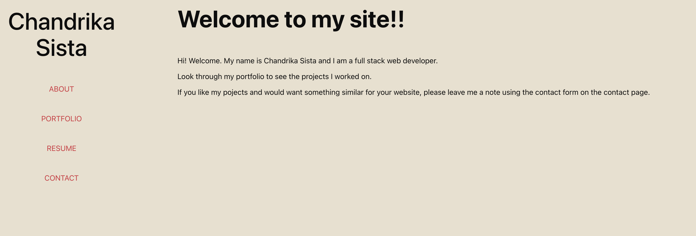

# A simple portfolio using React

## Portfolio site that allows me to showcase my projects and skills

## Features

- The code can be downloaded to you local machine. You need to install the packages using `npm install ` and then use `npm run dev` to start the site in your local host
- The site is responsive
- The portfolio page shows a few projects and new ones can be added without compromising on the design
- Users can use the contact form to send a message
- The contact form checks for empty fields and the email validation makes sure the users enter a valid email

## Installation Instructions

- Download the files from the repo
- Run `npm install` to install the necessary dependencies
- Run `npm run dev` and go to site on the local host

## Website Preview

## Working Example
[View the website here](https://gcsdesign-blog-43fec2242915.herokuapp.com/)

